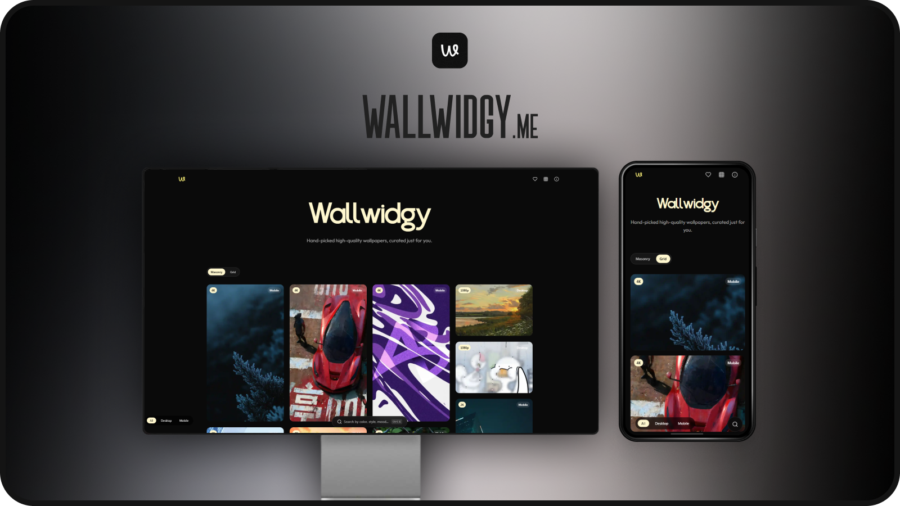

```markdown
# WallWidgy  

  

**A dynamic wallpaper repository site**  

WallWidgy powers [wallwidgy.me](https://wallwidgy.me), providing an efficient, visually appealing, and user-friendly platform for browsing and downloading high-quality wallpapers.  

---

## Features  

### 🚀 Optimized Performance  
- Wallpapers are served using optimized links, ensuring fast downloads and previews without quality compromise.  
- Integrated **Cloudinary** for faster image rendering and seamless previews.  

### 🖼️ Enhanced User Interface  
- A smooth **expanded view** with functional download options and loader animations for "Previous" and "Next" buttons, ensuring smooth transitions.  
- Custom **sort-by options** to easily organize wallpapers based on user preferences.  

### 🛠️ Streamlined Organization  
- Clean navigation with refined categories for better usability.  
- Integrated a robust API to enhance dynamic capabilities.  

### 💻 Customizable and Open Source  
- WallWidgy is open-source and fully customizable.  
- You are free to use this project, modify it, and repurpose it for any personal or commercial applications.  

---

## Getting Started  

1. Clone the repository:  
   ```bash
   git clone https://github.com/not-ayan/wallwidgy.git
   cd wallwidgy
   ```  

2. Update configuration settings (e.g., Cloudinary API, database, or deployment preferences).  

3. Deploy on your preferred hosting platform and enjoy!  

---

## Contributions  

We welcome contributions, bug fixes, and ideas for improvement. Open an issue or submit a pull request to help make WallWidgy even better.  

---

## License  

WallWidgy is licensed under the **MIT License**. Feel free to use it for personal or commercial purposes without restriction.  

---

### Live Demo  

Visit the live site: [wallwidgy.me](https://wallwidgy.me)  

Happy browsing! 🌟  
```
